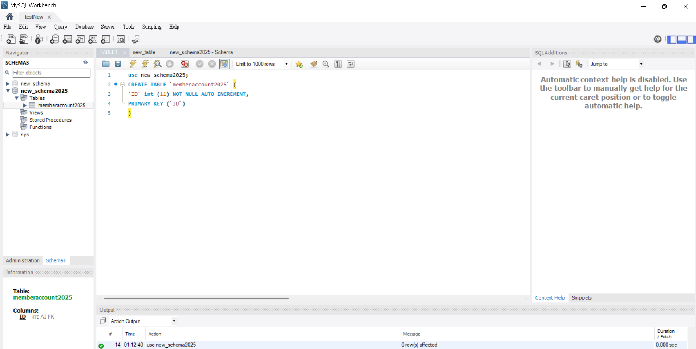
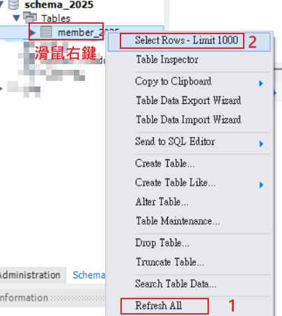

# MySQL

## 安裝 MYSQL、 MYSQL workbrench

尚未筆記，待補充

## workbrench 操作資料庫

[參考文章](https://ithelp.ithome.com.tw/m/articles/10215161)

-   在 MySQL 內 「schema」 等同是 「database 資料庫」

### 常用指令:

#### 新增資料表 Table 　

使用「new_schema2025」資料庫

建立「memberaccount2025」資料表 Table

資料庫自動新增欄位 ID

ID 值不得 null

ID 值是唯一 (primary key) 不得重複

```sql
use new_schema2025;  // 使用 new_schema2025 這個資料庫
CREATE TABLE `memberaccount2025` (
`ID` int (11) NOT NULL AUTO_INCREMENT,
PRIMARY KEY (`ID`)
)

```

`PRIMARY KEY` 指的是唯一值



## 新增 ID 後，refresh table 、選擇前 100 筆查看最新資料



#### select 對象欄位 from 資料表。

```sql
SELECT * FROM `ch6_crud`
SELECT student FROM ch6_crud
```

-   代表全部欄位
    student 代表欄位名稱

    `反引號，表示 SQL 欄位名稱可不填寫(不能用單引號或雙引號唷'"")

    '或" 單引號或雙引號表示資料內容是字串

VARCHAR(40) 表示可以最多 40 個字元(不是 40 bytes)，超過 40 就會錯誤或被截斷
Variable Character，表示可變長度的文字欄位

每個指令後面要有分號; 表示那一段指令結束

```sql
use database_name;
describle table_name;
```

查看表格
回傳 (截圖)

選取所有資料 from 表格

```sql
use database_name;
SELECT * FROM table_name;
```

## 自動新增 ID 不重複

正確寫法（不指定欄位，自動產生 ID）：

```sql
USE schema_2025;

INSERT INTO memberaccount2025 () VALUES ();
```

這樣會新增一筆資料，ID 自動遞增，例如從 1、2、3…

## 指令結束後要加分號; ?

-   多條指令，要加分號; 表示結束

```sql
USE schema_2025;
INSERT INTO memberaccount2025 (email) VALUES ('abc@example.com');
UPDATE memberaccount2025 SET email='test@example.com' WHERE ID=1;
```

-   `UPDATE`指令後面不用加分號，可以換行，UPDATE 後面要接 SET、WHERE 才是完整指令

```sql
UPDATE memberaccount2025
SET email = 'your_email@example.com'
WHERE ID = 2;
```

## 如果資料表已有主鍵，需要先刪除主鍵：

```sql
ALTER TABLE memberaccount2025 DROP PRIMARY KEY;
```

```sql
-- INSERT INTO member_2025() VALUES();

-- 選擇 member_2025 table 的所有資料--
SELECT \* From member_2025;

-- SELECT _ FROM member_2025 WHERE ID = '';
-- DELETE FROM member_2025 WHERE ID = ''
-- SELECT _ FROM member_2025 WHERE ID IS NULL;
-- SELECT \* FROM member_2025 WHERE ID = 2;
-- -- UPDATE member_2025 SET email = 'test01@gmail.com' WHERE ID = 1;
-- DELETE FROM member_2025 WHERE ID IS NULL;

-- 查詢目前幾筆資料
-- SELECT COUNT(\*) AS total_count FROM member_2025;

-- 建表語法（CREATE TABLE）
-- 新增欄位語法（ALTER TABLE）
-- 插入資料（INSERT INTO）
-- 修改資料（UPDATE）
-- 查詢資料（SELECT）
-- 刪除資料（DELETE）
```
