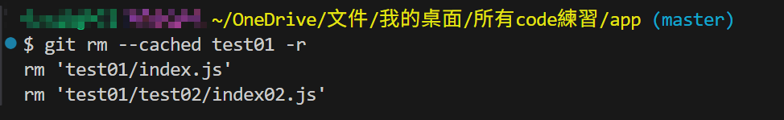
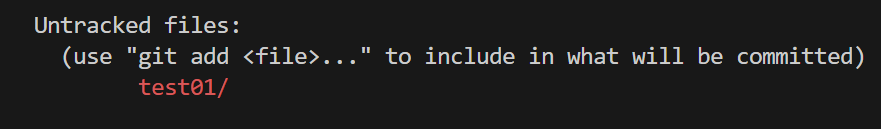

# .gitignore 設定忽略清單

在專案的根目錄，建立 `.gitignore` 檔案，在內部設定你想忽略專案中的某些資料夾或檔案，避免被 git 加入版本控制。

## 寫法:

假設 app 專案目錄架構如下

```bash
app/
├─ .gitignore
├── test01/
│   └── index.js
│   └── test02/
|       └── index02.js
├── images/
|   └── food.jpg
└── test02/
    ├── index.js
    ├── index02.js
    ├── test01/
    │   └── index.js
    │   └── test01/
    │       └── index.js
    └── food.jpg

```

```bash
//.gitignore
# 有效的註解
*.js # 無效的註解

# 忽略根目錄 test01 資料夾下的 index.js 檔案
/test01/index.js

# 忽略所有名稱為 test01 的資料夾(包括檔案、目錄)
test01*
# 下列不加入版控
# ./test01/index.js
# ./test01/test02/index02.js
# ./test02/test01/index.js
# ./test02/test01/test01/index.js


# 忽略「根目錄」的 test01 資料夾，不忽略子層的 test01
/test01
# 下列不加入版控
# ./test01/index.js
# ./test01/test02/index02.js

# 忽略 test02 資料夾(不分層級)
test02/
# 下列不加入版控
# ./test/test01/test02/index02.js
# ./test02/index.js
# ./test02/index02.js
# ./test02/test01/index.js
# ./test02/test01/test01/index.js
# ./test02/food.jpg


# /node_modules忽略根目錄的node_modules資料夾，node_modules/ 忽略資料夾內的所有內容
/node_modules/


# 忽略所有名稱為index02的檔案 (包括index02.js、index02.html 等)
index02.*

# 忽略所有以.js結尾的檔案
*.js

# 忽略所有 *.js 檔案，可是不忽略index.js
*.js
!index.js

```

=======================================================================

# 檔案已被 git 加入版本控制，現在希望停止追蹤它(從版本控制中移除)，如何做?

如果你 `.gitignore` 後還發現那個檔案還是會出現在 `git status`，就表示那個檔案之前已經被 Git 加進版本控制了。
解法如下，`Ctrl + ~ ` 開啟終端機，終端機(terminal)內輸入

```bash
git rm --cached filename_or_folder -r
```

### 舉例: 我想將 app 專案內的 test01 資料夾，移除對它的從版本控制

(只是移除版本控制的追蹤，實體檔案還是存在 app 專案內喔)

```bash
git rm --cached tets01 -r
```

結果如下，已移除對根目錄 test01 資料夾與檔案的 git 追蹤


輸入 `git status` 檢查:

