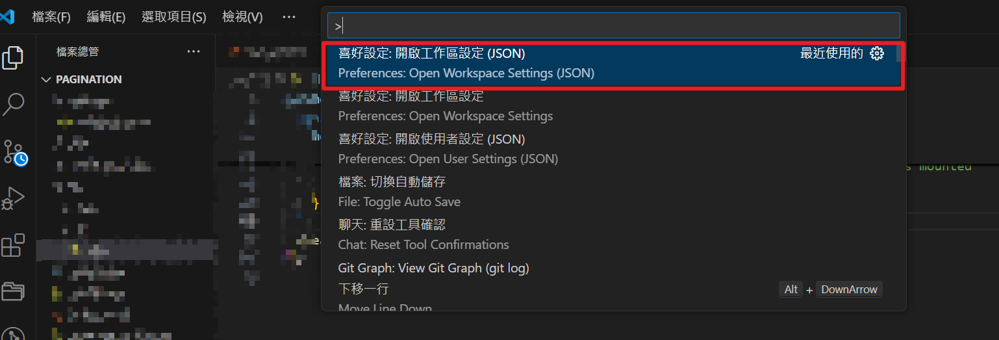

# Prettier 筆記

[1.Prettier 編輯器安裝擴充套件、只在本地工作區使用](#Prettier-編輯器安裝擴充套件、只在本地工作區使用)

[2.團隊使用方式(建議)](<#團隊使用方式(建議)>)

## Prettier 編輯器安裝擴充套件、只在本地工作區使用

只應用在自己本地專案資料夾、僅設定工作區(JSON)的做法:

-   1. vscode 編輯器，開啟專案
-   2.  `ctrl` + `shift` + `P` 打開設定
-   3. 輸入 `Preferences:Open workspace Settings(JSON)`
       

-   4. 貼上下列設定

```json
{
    "editor.formatOnSave": true,
    "editor.defaultFormatter": "esbenp.prettier-vscode"
}
```

`"editor.formatOnSave": true,`: 自動儲存
`"editor.defaultFormatter": "esbenp.prettier-vscode"`: 確認 editor.defaultFormatter 設為 esbenp.prettier-vscode。

### 建立.prettierrc 檔案

-   5. 回到專案根目錄，建立 `.prettierrc` 檔案，內容放你想要的排版設定

```json
{
    "semi": false,
    "singleQuote": true,
    "tabWidth": 2
}
```

當你存檔時，本地 `Prettier` 插件就會幫你的程式碼格式化。

"editor.defaultFormatter" 是 VSCode 的設定鍵，代表「預設格式化器」。
"esbenp.prettier-vscode" 是 Prettier 插件在 VSCode 的內部 ID，由作者 esbenp 發布的 prettier-vscode。
這樣 VSCode 就知道每次你按格式化（或存檔自動格式化）時，要用 Prettier 插件，而不是其他工具（像內建格式器、ESLint 等）。

### 不建立.prettierrc，使用 prettier 預設設定

`ctrl` + `shift` + `P` 打開設定
輸入以下設定

```json
{
    "editor.defaultFormatter": "esbenp.prettier-vscode",
    "editor.formatOnSave": true,
    "[javascript]": {
        "editor.formatOnSave": true
    },
    "[vue]": {
        "editor.formatOnSave": true
    }
}
```

說明:

```json
{
    "editor.defaultFormatter": "esbenp.prettier-vscode", //預設使用 Prettier 作為程式碼的格式化工具。是 Prettier 的 VS Code 擴充套件 ID。
    "editor.formatOnSave": true, //每次你儲存檔案（Ctrl+S 或 Cmd+S）時，VS Code 會自動幫你格式化整份文件。套用在所有檔案類型（除非下面有覆蓋設定）。
    "[javascript]": {
        "editor.formatOnSave": true //僅針對 .js 檔案，儲存時啟用自動格式化。如果你前面全域設定是 false，這行可以讓 JS 檔案獨立啟用格式化。
    },
    "[vue]": {
        "editor.formatOnSave": true //針對 .vue 檔案，儲存時也自動格式化。
    }
}
```

哪裡查看 prettier 預設的排版設定?

## 團隊使用方式(建議)

(待補)

```

```
